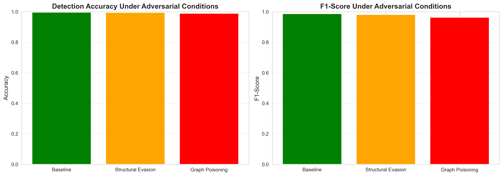

# Social Network Analysis with Bot Detection and Adversarial Attacks

## Project Overview
This research project implements a comprehensive framework for analyzing social network structures, detecting automated accounts, and evaluating classifier robustness against adversarial attacks. The implementation uses the Facebook Egonets dataset from the Stanford Network Analysis Project (SNAP).

## Dataset
- **Source**: [Stanford SNAP - Facebook Social Circles](https://snap.stanford.edu/data/egonets-Facebook.html)
- Download `facebook_combined.txt.gz`
- Extract `facebook_combined.txt` to a `facebook/` directory in the project root

## Implementation Details

### 1. Graph Metrics
- **Degree Analysis**: Node degree distribution, average neighbor degree
- **Clustering Coefficient**: Local triangle density measurement
- **Centrality Measures**: Betweenness, closeness, and eigenvector centrality
- **PageRank**: Iterative importance ranking algorithm
- **Community Detection**: Greedy modularity optimization

### 2. Classification System
- Random Forest ensemble classifier
- Feature extraction from graph structure
- Stratified train-test split (70/30)
- Standard scaling preprocessing
- Performance evaluation via precision, recall, F1-score

### 3. Adversarial Attack Implementations

#### Structural Evasion Attack
Modifies local graph topology of flagged nodes:
- Triangle completion to increase clustering coefficients
- Strategic edge removal to normalize degree distribution
- Preferential attachment to high-centrality nodes

#### Graph Poisoning Attack
Data corruption through strategic injection:
- Sybil node insertion with deceptive connection patterns
- Adversarial edge creation between disparate node classes
- Label poisoning to corrupt training data integrity

### 4. Visualization Pipeline
- Network topology visualization with force-directed layout
- Node classification through color encoding
- Performance metrics comparison across experimental conditions
- Statistical analysis plots

## Installation

```bash
pip install -r requirements.txt
```

## Execution

```bash
python main.py
```

The analysis pipeline executes the following workflow:
1. Network construction from dataset
2. Feature extraction and metric computation
3. Baseline classifier training and evaluation
4. Structural evasion attack simulation
5. Graph poisoning attack simulation
6. Comparative performance analysis
7. Visualization generation

## Output Files
- `graph_baseline.png` - Original network visualization
- `graph_structural_evasion.png` - Network after structural attack
- `graph_poisoning.png` - Network after poisoning attack
- `performance_comparison.png` - Model performance across conditions

## Visualizations

### Network Graphs

#### Baseline Network


#### Network After Structural Evasion Attack


#### Network After Poisoning Attack


### Performance Metrics


## Experimental Results
The system evaluates classifier performance across three conditions:
1. **Baseline** (clean data)
2. **Post-Structural Evasion** (topology manipulation)
3. **Post-Graph Poisoning** (data corruption)

Evaluation metrics:
- Classification accuracy
- F1-score (harmonic mean of precision and recall)
- Per-class precision and recall

## Project Structure
```
.
├── main.py                 # Main implementation
├── requirements.txt        # Python dependencies
├── README.md              # This file
├── assignment.txt         # Project requirements
└── facebook/              # Dataset directory (create this)
    └── facebook_combined.txt
```

## Key Findings
- **Structural Evasion**: Targeted topology manipulation reduces per-node detectability by mimicking legitimate network patterns
- **Graph Poisoning**: Dataset corruption degrades overall classifier performance through training data contamination
- Both attack vectors successfully degrade model efficacy through distinct mechanisms

## References
- Stanford SNAP: https://snap.stanford.edu/data/egonets-Facebook.html
- NetworkX Documentation: https://networkx.org/
- Scikit-learn: https://scikit-learn.org/
